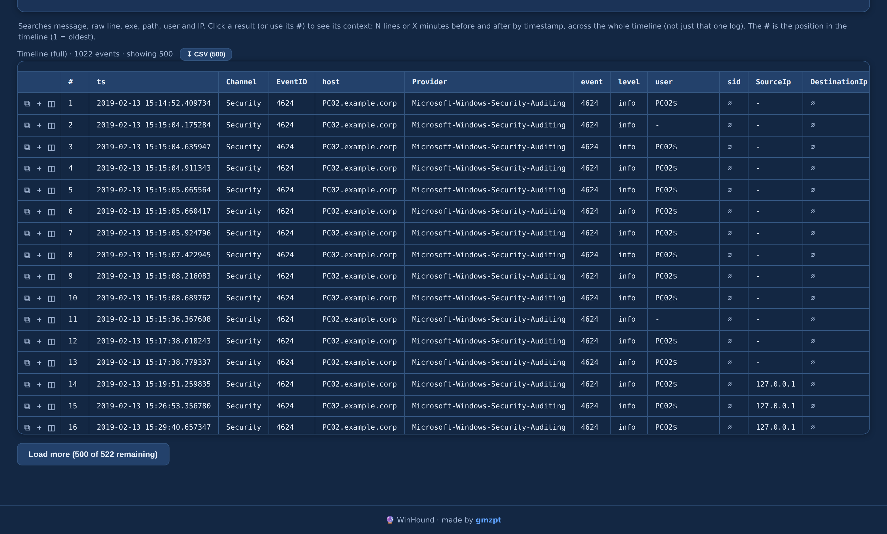
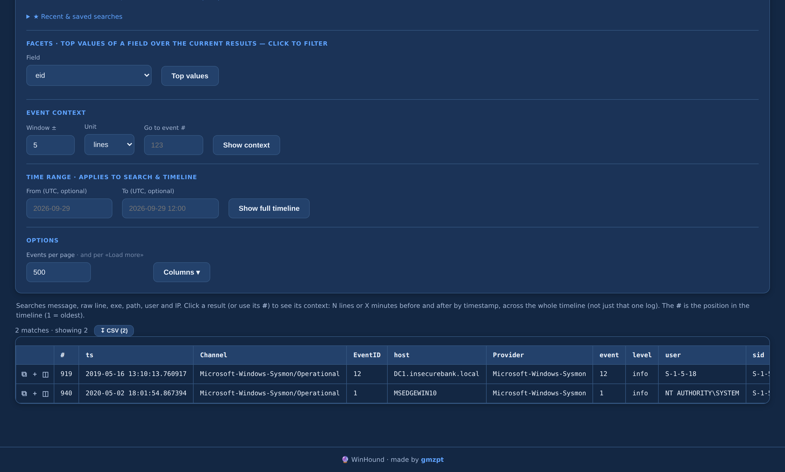
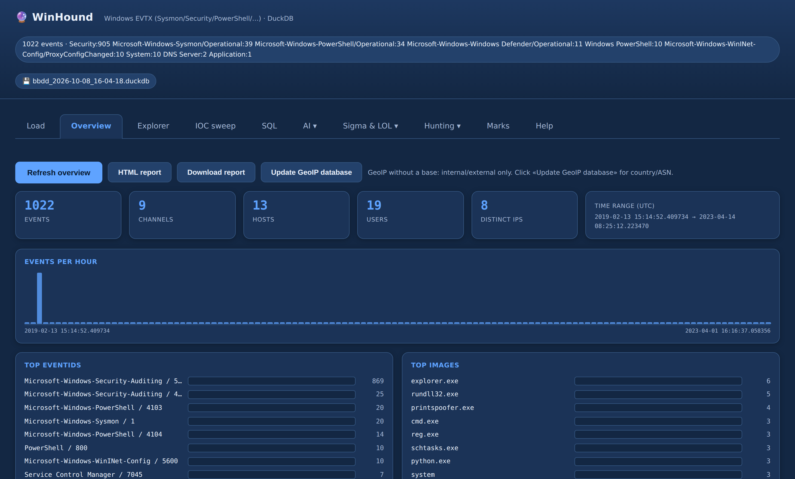
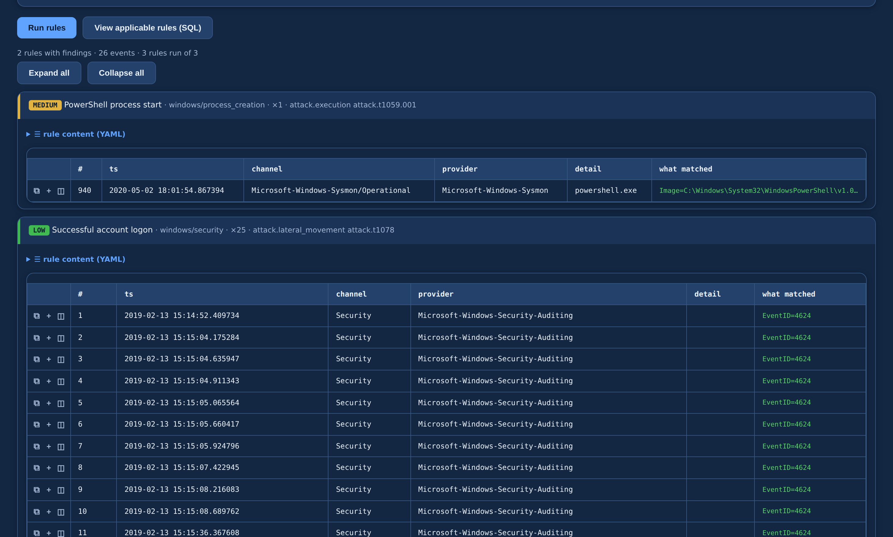

<div align="center">

# 🐕 WinHound

**Forensic Windows EVTX analyzer — ingest event logs, query with SQL, hunt with Sigma.**

Feed it `.evtx` files (even straight from a `.zip`/archive), open the browser,
and investigate: timeline, full‑text + field search, Sigma & LOL detections,
process tree, logons, persistence, ATT&CK and a one‑click case report.
Runs **100% offline**.


</div>

---

## 🚀 Quickstart

```bash
pip install -r requirements.txt
python run.py                 # open http://127.0.0.1:8000
```

```bash
python run.py --port 8001     # run next to Longanizer on another port
python run.py --db case.duckdb  # keep the case in a file instead of memory
```

> 🧪 **Try it now:** 562 attack EVTX ship in `samples/evtx-attack-samples.zip`.
> Unzip it and load the folder, or point the loader straight at the `.zip`.

## 🧭 How you use it

1. **📥 Load** — drop `.evtx` files or an archive (extracted recursively). Sysmon & native channels are normalized.
2. **🔎 Explore** — browse the timeline or search. Words = AND, `field:value` filters, `-term` excludes, `/regex/`, `eid=4688`. The box autocompletes field names.
3. **🛡️ Hunt** — run your **Sigma** rules and **LOL** packs (LOLBAS/LOLDrivers/LOLRMM/HijackLibs/LOTTunnels) with live progress; see the ATT&CK coverage of the case.
4. **🌲 Dig in** — process tree, logons, persistence, PowerShell script blocks, network.
5. **📌 Triage & report** — mark events, then export a self‑contained HTML case report.

## 📸 In action

> Loaded with EVTX from the bundled `samples/evtx-attack-samples.zip` (Security, Sysmon, PowerShell…).

**Explorer — full EVTX timeline (channel, EventID, host, user…)**



**Search — `image:powershell`, `eid=4624`, `/regex/` and `-exclude`**



**Overview — Windows dashboard (top EventIDs, top images, hosts, users)**



**Sigma — your rules run over the EVTX, with “what matched” per hit**



## ✨ What's inside

| | |
|---|---|
| 🪟 **EVTX ingest** | any channel, Sysmon‑aware, recursive from archives |
| 🔎 **Smart search** | `field:value` / `=exact` / `!=` / `-NOT` / `/regex/` / `field:*` exists · field autocomplete · facets |
| 🛡️ **Sigma engine** | product‑exclusion filter, correlation, "what matched", per‑rule YAML & review buttons |
| 🧰 **LOL packs** | LOLBAS · LOLDrivers · LOLRMM · HijackLibs · LOTTunnels — with a top‑indicator chart |
| 🥸 **Lookalike** | masquerading binaries by edit distance across all sources |
| 🗺️ **ATT&CK matrix** | coverage of the case built from Sigma hits |
| 🌲 **Hunting views** | process tree (from a PID), logons (Kerberos/NTLM/RDP), persistence, PowerShell, network |
| 🎯 **IOC sweep** | paste IOCs and sweep the whole dataset, export CSV |
| 🌐 **GeoIP / ASN** | public IPs tagged with country + Org/ISP (offline DB‑IP Lite) |
| ⏱️ **Live ingest** | progress with start / elapsed / ETA |
| 🤖 **AI & MCP** | optional AI tab and an MCP server to query the case from Claude |

## 📝 Notes

- Everything runs locally — no cloud, no outbound calls except the optional GeoIP database download.
- Cases are DuckDB files under `casos/` (git‑ignored). Use `--db` to pin one.
- Sigma rules without `product: windows` still run (multiplatform); only rules with a non‑Windows product are skipped.

## 🔄 Updating

Grab the latest version without git — the updater checks GitHub and updates the
app in place, **keeping your cases and GeoIP databases** (`casos/`, `geoip_data/`):

```bash
python update.py            # check for a new version and update (asks first)
python update.py --check    # only check, change nothing
python update.py --yes      # update without asking
```

(Cloned with git? `git pull` works too.)

## 📜 License

Licensed under the **Apache License 2.0** — free to use, modify and distribute
(including commercially); just keep the copyright and `NOTICE`, and state your
changes. See [`LICENSE`](LICENSE).

© 2026 Gregorio Moreno (**gmzpt**)
